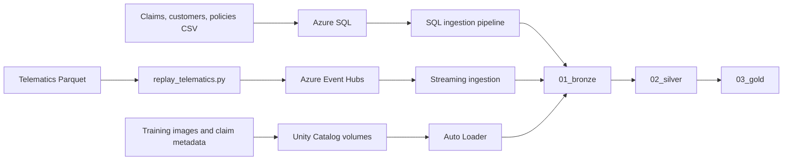

# Smart Claims Data Pipeline

An insurance data engineering project that brings policy, customer, claim, vehicle telematics, and image data into Databricks. It demonstrates three ingestion paths and a bronze → silver → gold model for preparing claims data for analysis.

## What the project does

| Source | Ingestion path | Result |
| --- | --- | --- |
| `data/claims.csv`, `customers.csv`, `policies.csv` | Local Python loader → Azure SQL → Databricks SQL ingestion pipeline | Bronze claims, customers, and policies |
| `data/telematics/*.parquet` | Local Event Hubs producer → Event Hubs Kafka endpoint → Databricks streaming pipeline | Bronze telematics events |
| `data/training_imgs/*.png` and `data/claims/metadata/image_metadata.csv` | Upload to Unity Catalog volumes → Auto Loader | Bronze training images and claim image metadata |

Silver tables clean and enrich the bronze data. Gold materialized views combine claims with policies and customers, aggregate telematics by vehicle, and join those results into a claims view.



## Repository guide

| Path | Purpose |
| --- | --- |
| `scripts/azure_sql/load_source_tables.py` | Creates missing Azure SQL tables and inserts CSV rows with new primary keys. Existing tables are preserved. |
| `scripts/azure_sql/enable_change_tracking_and_cdc.py` | Enables Change Tracking and CDC for the three Azure SQL tables. |
| `scripts/azure_sql/install_lakeflow_sql_utilities.py`, `utility_script.sql` | Installs and runs Lakeflow SQL utility objects for the ingestion user. |
| `scripts/event_hubs/replay_telematics.py` | Replays telematics Parquet rows as JSON events to Event Hubs. |
| `databricks_codes/01_streaming_ingestion/` | Reads Event Hubs through its Kafka endpoint into bronze telematics. |
| `databricks_codes/02_sql_server_ingestion/` | Contains numbered steps for configuring the SQL ingestion pipeline in Databricks. |
| `databricks_codes/03_object_storage_ingestion/` | Reads claim image metadata CSV and training images from volumes. |
| `databricks_codes/04_medalion_transformation/` | Defines silver streaming tables and gold materialized views. |
| `data/` | Local CSV, Parquet, image, and metadata inputs; excluded from the public repository. |
| `screenshots/` | Captures of the Databricks ingestion, transformation, and scheduled workflow. |

## Pipeline screenshots

| View | Screenshot |
| --- | --- |
| Azure resource group and services | [azure_resource_group_overview.png](screenshots/azure_resource_group_overview.png) |
| Scheduled end-to-end workflow | [scheduled_pipeline_workflow.png](screenshots/scheduled_pipeline_workflow.png) |
| Object storage ingestion | [object_storage_ingestion_pipeline.png](screenshots/object_storage_ingestion_pipeline.png) |
| Event Hubs telematics ingestion | [telematics_event_hubs_ingestion.png](screenshots/telematics_event_hubs_ingestion.png) |
| Event Hubs namespace metrics | [event_hubs_namespace_metrics.png](screenshots/event_hubs_namespace_metrics.png) |
| Azure SQL ingestion | [azure_sql_ingestion_pipeline.png](screenshots/azure_sql_ingestion_pipeline.png) |
| Bronze-to-gold transformations | [bronze_silver_gold_transformation.png](screenshots/bronze_silver_gold_transformation.png) |

## Prerequisites

- Python 3.13 for local scripts. Install the project dependencies with `python -m pip install -e . requests`. The narrower `requirements.txt` is sufficient for `scripts/event_hubs/replay_telematics.py` only.
- An Azure SQL database reachable from the machine running the loader, with an account allowed to create tables and configure Change Tracking and CDC.
- An Azure Event Hub named `telematics`, with a **Send** connection string for `replay_telematics.py` and a **Listen** connection string for Databricks.
- A Databricks workspace with Unity Catalog catalog `smart_claims_catalog`, schemas `00_landing`, `01_bronze`, `02_silver`, and `03_gold`, and volumes at the paths used below.
- A Databricks pipeline that runs the Python sources under `databricks_codes/`. The SQL source ingestion pipeline must also be configured in Databricks.

The `data/` directory is intentionally excluded from Git because it can contain customer and claim information. Supply your own authorized data at the paths in the source table above before running the local scripts. The screenshots document pipeline structure and do not include the underlying source records.

The code currently uses the Event Hubs namespace `smart-claims-streaming` and the catalog and schema names above. Change those constants in the source files if your resources use other names.

## Run the local setup

Run commands from the repository root. Put local credentials in `.env`, which is ignored by Git:

```dotenv
SQL_SERVER=<server>.database.windows.net
SQL_DATABASE=<database>
SQL_USER=<user>
SQL_PASSWORD=<password>
EVENTHUB_CONNECTION_STRING=<connection string with Send permission>
```

Environment variables take precedence over `.env`. Never commit credentials. Rotate any credentials that were previously stored in source code.

### 1. Load the relational source tables

```powershell
python scripts/azure_sql/load_source_tables.py
```

The loader creates `dbo.claims`, `dbo.customers`, and `dbo.policies` if needed. On later runs it inserts only CSV rows whose primary key is absent from the matching table. It does not update existing rows. Existing tables must already have primary keys on `claim_no`, `customer_id`, and `POLICY_NO`, respectively. Duplicate keys within an input CSV are reduced to the first occurrence.

### 2. Prepare Azure SQL for change ingestion

```powershell
python scripts/azure_sql/enable_change_tracking_and_cdc.py
python scripts/azure_sql/install_lakeflow_sql_utilities.py
```

Review each command's output: these scripts log some SQL failures as `[WARN]` and continue. Follow the numbered guide in `databricks_codes/02_sql_server_ingestion/create_ingestion_pipeline.txt` to configure Databricks SQL ingestion from `dbo.claims`, `dbo.customers`, and `dbo.policies` into `smart_claims_catalog.01_bronze`. The guide is a manual runbook, not an executable pipeline definition.

### 3. Replay telematics events

Check the JSON output locally before sending events:

```powershell
python scripts/event_hubs/replay_telematics.py --dry-run --limit 3
```

Send a small sample, or replay the whole data set:

```powershell
python scripts/event_hubs/replay_telematics.py --interval-seconds 1 --limit 10
python scripts/event_hubs/replay_telematics.py
```

`replay_telematics.py` reads `data/telematics/*.parquet` in filename order and encodes each row as one JSON event. By default it sends up to 100 events per batch; Event Hubs' byte limit can make a batch smaller. Set `--batch-size N` to adjust the maximum. Setting `--interval-seconds` sends one event at a time to preserve the requested pacing.

The producer records the last acknowledged source position in the root `.producer-checkpoint` after each successful batch. After an interruption, use `python scripts/event_hubs/replay_telematics.py --resume`. Use `--skip N` to start after a known number of source rows; `--resume` and `--skip` cannot be combined. The default delay is zero seconds. The producer stops at the end of the files or on Ctrl+C. As with the previous replay, a connection failure after Event Hubs accepts a batch but before the acknowledgement reaches the client can cause a batch to be sent again.

### 4. Stage image data

Upload the files to these paths before starting their Auto Loader sources:

| Local path | Databricks volume path |
| --- | --- |
| `data/training_imgs/*.png` | `/Volumes/smart_claims_catalog/00_landing/training-imgs/` |
| `data/claims/metadata/image_metadata.csv` | `/Volumes/smart_claims_catalog/00_landing/claims/metadata/` |

The claim metadata source declares the unqualified table name `claim_images_meta`; set its pipeline default catalog and schema to the intended bronze destination. The training image source declares `smart_claims_catalog.01_bronze.training_images` explicitly.

### 5. Configure the Event Hubs listener in Databricks

Store the **Listen** connection string in a Databricks secret. Map that secret to the Spark property read by `databricks_codes/01_streaming_ingestion/ingest_event_hubs_telematics.py` in the pipeline settings:

```json
{
  "clusters": [{
    "spark_conf": {
      "eventhub.connectionString": "{{secrets/<scope-name>/<secret-name>}}"
    }
  }]
}
```

Use the actual secret scope and key names. The producer's local **Send** connection string is separate from this listener secret.

### 6. Run the Databricks transformations

Add the streaming, object storage, and transformation Python files to a Databricks pipeline, with the required catalog, schemas, volumes, and SQL bronze tables already available. The pipeline defines these outputs:

| Layer | Tables or views | Main operation |
| --- | --- | --- |
| Bronze | `telematics`, `training_images`, `claim_images_meta`, plus SQL ingested `claims`, `customers`, `policies` | Preserve incoming records and metadata. |
| Silver | `telematics`, `training_images`, `claims`, `customers`, `policies` | Parse dates, normalize names, derive image labels, adjust premiums, and record data quality expectations. |
| Gold | `aggregated_telematics` | Speed statistics and event count per `chassis_no`. |
| Gold | `customer_claim_policy` | Left joins claims to policies and customers. |
| Gold | `customer_claim_policy_telematics` | Adds vehicle telematics aggregates to claims with a customer borough. |

The image data is ingested and prepared in bronze and silver; it is not currently used by the gold views or an image model.

## Verification and current limits

After running the pipelines, check that all expected bronze and silver tables exist and that gold views contain the expected claim and vehicle keys. Inspect the Databricks pipeline event log for data quality expectation results and ingestion errors.

The gold `aggregated_telematics` view calculates its maximum event timestamp separately from its `last_latitude` and `last_longitude` aggregations. Those coordinates are therefore **not guaranteed to come from the newest event**. The current pipeline also has no checked-in automated SQL ingestion definition or end-to-end test. Treat the repository as a reproducible starting point and validate results in your own Azure and Databricks environment.
